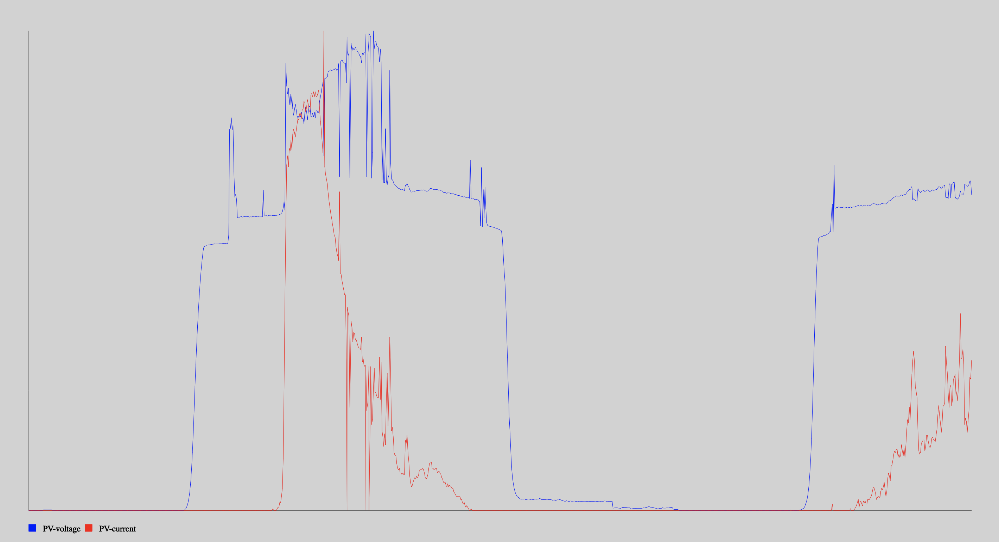
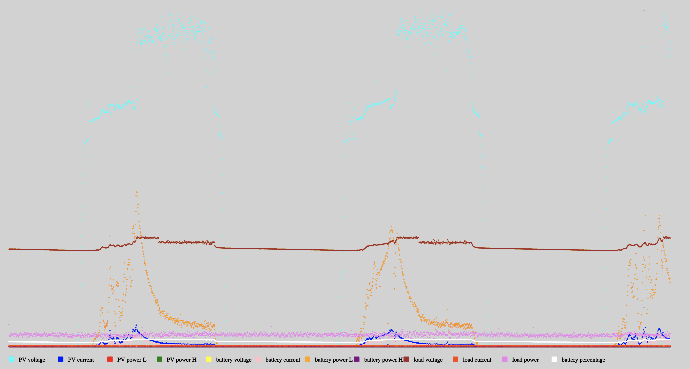
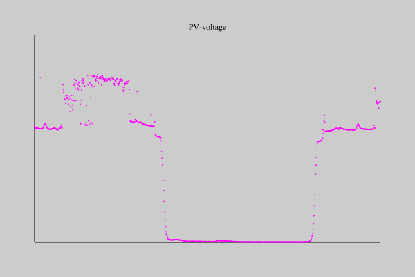

# Working with Solar Protocol Data 

- Data is from the Solar Protocol API: [http://solarprotocol.net/api/v2/](http://solarprotocol.net/api/v1/). Please read the documentation there.
- Offline examples of API data are saved in the data folder in this repository.

Examples are in Javascript (p5js) and Python (Gizeh).

## P5JS (client side rendering)
- Javascript using the P5 library. [https://p5js.org/](https://p5js.org/)
- If running your code from a local server, access the network data direct from [the Solar Protocol API](http://solarprotocol.net/api/v1/). If developing in an online editor, you will need to use the development server to access network data due to the [Cross-Origin Resource Sharing standard](https://developer.mozilla.org/en-US/docs/Web/HTTP/CORS/Errors) that will block http requests from https servers. Development server is here: [https://server.solarpowerforartists.com](https://server.solarpowerforartists.com/)


#### Install p5.js:
- Either download the [library and run a server locally](https://p5js.org/download/).
- Or use the [online editor](https://editor.p5js.org/).

### Example: 0-single-value
- Access a single data point from the server
- [Code](https://github.com/tegacodes/SolarProtocolDataViz/blob/main/p5js/0-single-value/sketch.js)
- [Example in code editor](https://editor.p5js.org/brain/sketches/hVA39SS-c)

To access the data, [loadJSON()](https://p5js.org/reference/#/p5/loadJSON) is used with a callback function called gotData. 

```
loadJSON(URL, gotData); 
```

### Example: 1-value-duration
- Work with the timeseries of a charge controller parameter like current or voltage. 
-  [Code](https://github.com/tegacodes/SolarProtocolDataViz/blob/main/p5js/1-value-duration/sketch.js)
-  [Example in code editor](https://editor.p5js.org/brain/sketches/VSCXfAwJ6)

- Uses day.js library to deal with dates and timestamps: [https://day.js.org/en/](https://day.js.org/en/)



### Example: 2-cc-data
- Visualize the timeseries of all charge controller parameters
- [Code](https://github.com/tegacodes/SolarProtocolDataViz/blob/main/p5js/2-cc-data/sketch.js)
- [Example in code editor](https://editor.p5js.org/brain/sketches/TThNw8pbk)

- Uses day.js library to deal with dates and timestamps: [https://day.js.org/en/](https://day.js.org/en/)



### Example: 3 Point of Entry
- Visualizes time series of parameters from all servers on the network.
- [Code](https://github.com/tegacodes/SolarProtocolData/tree/main/p5js/point-of-entry)

## Python (server side rendering)

- Visualizing data server side using Python and a library called Gizeh 
- Documentation: [https://github.com/Zulko/gizeh](https://github.com/Zulko/gizeh)

#### Install Gizeh

- Upgrade pip: `python3 -m pip install --upgrade pip`
- Install [cairo](https://www.cairographics.org/) `sudo apt-get install libcairo2-dev`
- Install gizeh `sudo pip3 install gizeh`
- Or use the [online editor](https://editor.p5js.org/).

#### Notes on Gizeh

Color  

- Takes RGB color of the form (r,g,b) where each element is comprised between 0 and 1 (1 is 100%).  
- (1,1,1) is white
- (0,0,0) is black
- See the rip codes in [this online color converter](https://a.atmos.washington.edu/~ovens/javascript/colorpicker.html) 

### Example: 0-single-value
- Access a single data point from the server
- [Code](https://github.com/tegacodes/SolarProtocolDataViz/blob/main/gizeh/examples/solar-protocol/0-single-value.py)


### Example: 1-value-duration
- Work with the timeseries of a charge controller parameter like current or voltage. 
-  [Code](https://github.com/tegacodes/SolarProtocolDataViz/blob/main/gizeh/examples/solar-protocol/1-value-duration.py)




### Example: 2-cc-data
- Visualize the timeseries of all charge controller parameters
- Code coming soon.


